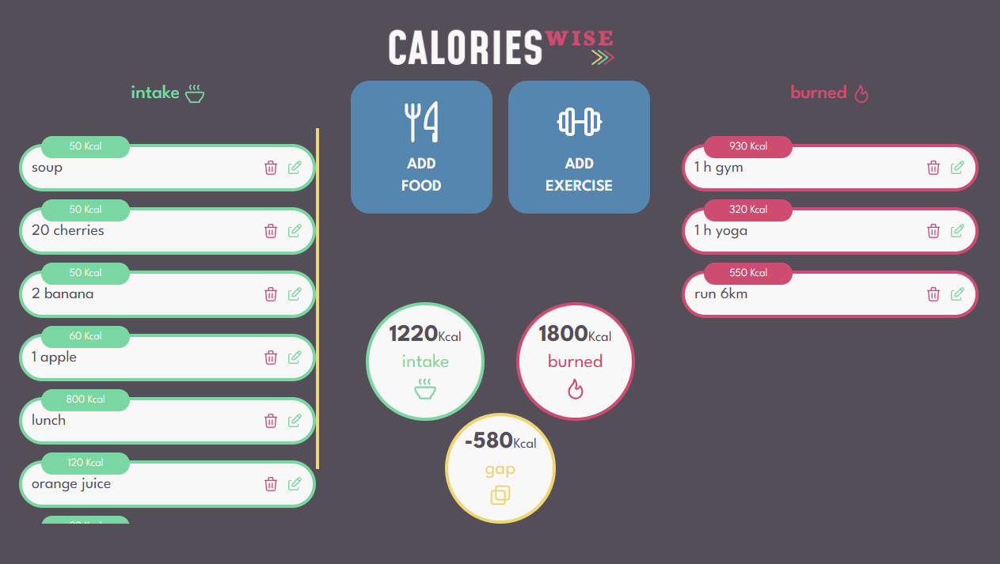
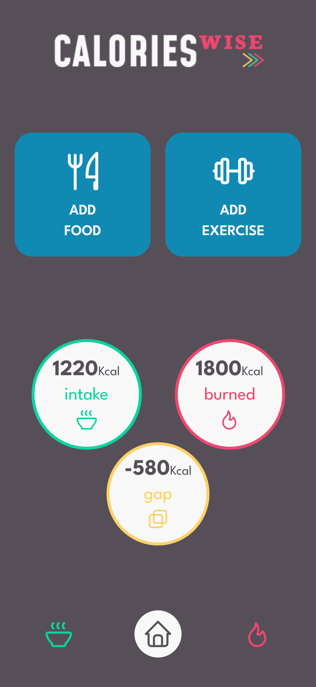
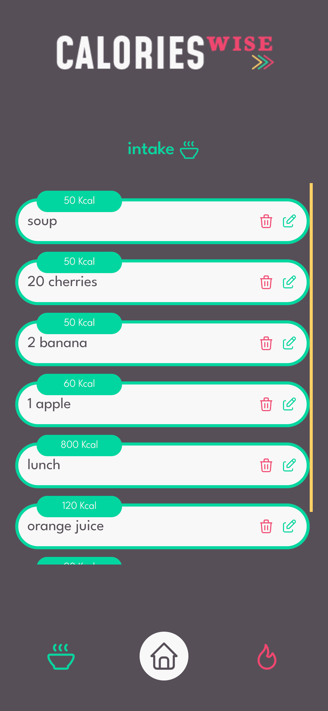

<h1>Calories Wise App 🍏💪</h1>

    
    
    
    
  

 

## 🚨Overview

The Calorie Tracker App is a responsive web application designed with Figma to
help users keep track of their consumed and burned calories. It features
separate lists for eating and exercise activities, with advanced React concepts
such as custom hooks, memoization, effects, and reducers utilized for efficient
state management. The app is built using Vite, React, TypeScript, and Tailwind
CSS, ensuring a modern and responsive user interface. Smooth animations enhance
the mobile version of the app, providing a delightful user experience.

## 🔋 Features

- **Consumed and Burned Calories Tracking**: Users can add, edit, and delete
  eating and exercise activities to track their consumed and burned calories.

- **Separate Lists**: The app features separate lists for eating and exercise
  activities, allowing users to easily differentiate between the two.

- **Statistics Section**: Users can view detailed statistics comparing consumed
  and burned calories, providing valuable insights into their daily activities.

- **Responsive Design**: The app is responsive, with different layouts for web
  and mobile devices, ensuring a consistent user experience across all
  platforms.

- **Smooth Animations**: Smooth animations enhance the mobile version of the
  app, providing a delightful user experience.

## ⚒️ Tech Stack

- Vite
- React.js
- TypeScript
- Tailwind
- Figma

## 💾 Installation

To run the application locally:

1. Clone the repository to your local machine.
2. Navigate to the project directory.
3. Run `npm install` to install the dependencies.
4. Run `npm run dev` to start the development server.

## 📒 Usage

1. Open the application in your web browser.
2. Add eating and exercise activities to track consumed and burned calories.
3. Edit or delete activities as needed.
4. View detailed statistics comparing consumed and burned calories.
5. Enjoy the smooth animations on the mobile version of the app!

## 🚀 Live Demo

Check out the live version of the app [here](https://calories-wise.netlify.app).

## 🔑License

This project is licensed under the NetNeoWeb License.

## 🎬Preview

